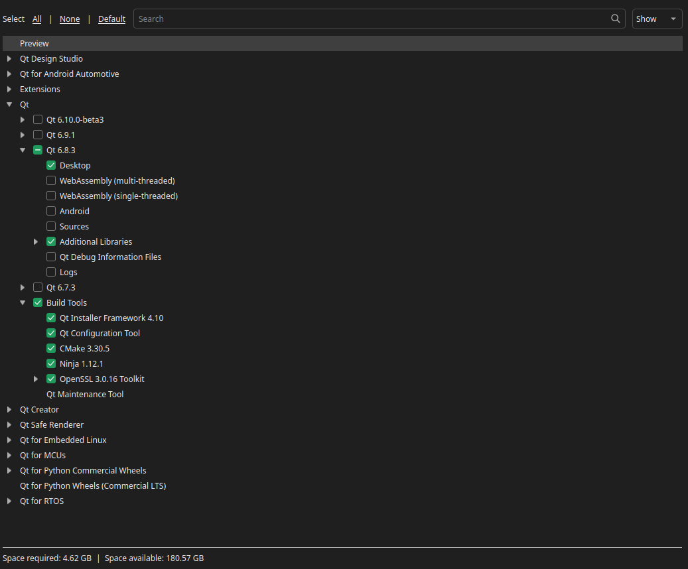

# Fast Backtest App

[](LICENSE)
[](https://isocpp.org)
[](https://qt.io)
[](https://cmake.org)

## Overview

**Fast Backtest App** is a Qt-based trading backtesting application designed to be as fast as possible while providing a rich backtesting results analysis experience. For that, it leverages a multi-threaded C++ engine for computations and a user-friendly Qt interface for visualizations. Thanks to Qt, this application is cross-platform and can run on Windows, macOS, and Linux.

### ✨ Project Highlights

- **Optimized performance**: Multi-threaded C++ backtest engine
- **Advanced GUI**: Native Qt application with ChartDirector visualizations
- **Comprehensive analysis**: Advanced metrics, interactive charts, and detailed histories

### 🎯 Main Features

#### High-performance backtesting
- C++ engine optimized for speed
- Qt GUI with advanced visualizations
- Complete metrics (Sharpe, Sortino, drawdown, etc.)
- Trade analysis and equity curves

#### Monitoring and analysis
- Detailed logging and histories
- Jupyter Notebooks for data fetching, processing, and analysis
- Export results and reports

### 🏗️ Technical Architecture

The project adopts a modular architecture for better code organization and performance:

- **Frontend**: Native [Qt6](https://www.qt.io/product/qt6) interface for a smooth user experience
- **Computation engine**: C++20 for backtests and intensive calculations
- **Visualization**: [ChartDirector](https://www.advsofteng.com/index.html) for professional and huge data quantity charts
- **Build system**: Cross-platform CMake with automation scripts

This approach ensures both fast execution for backtests and flexibility for strategy development.

### 📸 Interface Preview


*Qt graphical interface of the backtesting application with ChartDirector visualizations*

---
## User Guide
### Quick Start
You can download the latest release from this website: https://fintechcpp.github.io/fast-backtest-app-releases/
1. Download the appropriate archive for your operating system (Linux, Windows, or macOS).
2. Extract the archive and run the executable.

### Lua scripting mini guide

If you enable optional Lua scripting for a strategy, see the mini user documentation:

- [Lua script mini documentation](LUA_SCRIPT_DOC.md)


# Installation for developers

### 1. Clone the repository

Clone the repository and go to the project root:

```bash
git clone https://github.com/FinTechCpp/fast-backtest-app
cd fast-backtest-app
# initialize submodules
git submodule update --init --recursive
# pull LFS files for main project
git lfs pull
# pull LFS files for submodules
git submodule foreach --recursive 'git lfs pull || true'
```

## 2. Build and Run Guide for fast-backtest-app

This guide explains how to build, run, and debug the fast-backtest-app project step by step, from manual methods to more advanced configurations.

### Prerequisites

- CMake 3.14 or higher
- GCC/G++ with C++20 support
- Qt6.8.3 (Core, Widgets, Charts, Network)
- VS Code (for debugging)
- VS Code Extensions: C/C++, CMake Tools

### 🔧 Prerequisite Installation

#### Step 1: Install build tools (Linux only)

Install essential development tools:

```bash
# Update packages
sudo apt update

# Install build tools
sudo apt install -y build-essential git curl wget

# Install required graphics libraries for Qt
sudo apt install -y libgl1-mesa-dev libglu1-mesa-dev
sudo apt install -y libxcb-cursor0 libxcb-cursor-dev
```

#### Step 2: Install CMake 4.0.3

Download and install CMake manually to get a recent version:

#### Linux

```bash
# Download CMake 4.0.3
cd ~
wget https://github.com/Kitware/CMake/releases/download/v4.0.3/cmake-4.0.3-linux-x86_64.tar.gz

# Extract the archive
tar -xzf cmake-4.0.3-linux-x86_64.tar.gz

# Add CMake to PATH (temporary)
export PATH=$HOME/cmake-4.0.3-linux-x86_64/bin:$PATH

# Check installation
cmake --version
```

#### Windows 11

```powershell
# Download CMake 4.0.3 installer (run in PowerShell as Administrator)
cd ~\Downloads
Invoke-WebRequest -Uri "https://github.com/Kitware/CMake/releases/download/v4.0.3/cmake-4.0.3-windows-x86_64.msi" -OutFile "cmake-4.0.3-windows-x86_64.msi"

# Install CMake (this will add CMake to PATH automatically)
Start-Process msiexec.exe -Wait -ArgumentList '/i cmake-4.0.3-windows-x86_64.msi /quiet ADD_CMAKE_TO_PATH=System'

# Restart your terminal, then check installation
cmake --version
```

Alternative manual installation for Windows:
1. Download the installer from: https://github.com/Kitware/CMake/releases/download/v4.0.3/cmake-4.0.3-windows-x86_64.msi
2. Run the installer
3. During installation, select "Add CMake to the system PATH for all users"
4. Complete the installation
5. Open a new PowerShell/CMD window and verify: `cmake --version`

#### Step 3: Install Qt 6.8.3

Download and install Qt from the official website:

#### Linux

```bash
# Download Qt Online Installer
cd ~
wget https://d13lb3tujbc8s0.cloudfront.net/onlineinstallers/qt-unified-linux-x64-4.6.1-online.run

# Make the installer executable
chmod +x qt-unified-linux-x64-4.6.1-online.run

# Run the installer
./qt-unified-linux-x64-4.6.1-online.run
```

#### Windows 11

```powershell
# Download Qt Online Installer (run in PowerShell)
cd ~\Downloads
Invoke-WebRequest -Uri "https://d13lb3tujbc8s0.cloudfront.net/onlineinstallers/qt-unified-windows-x64-4.6.1-online.exe" -OutFile "qt-unified-windows-x64-4.6.1-online.exe"

# Run the installer
Start-Process ".\qt-unified-windows-x64-4.6.1-online.exe"
```

Alternative manual download for Windows:
1. Download the installer from: https://www.qt.io/download-dev
2. Run the executable
3. Follow the installation wizard

**Qt installer instructions (Linux & Windows):**
1. Create a Qt account (free for personal use)
2. Select **Custom installation**
3. Select **Qt 6.8.3**
4. Check the required components:
   - For Linux: Desktop gcc 64-bit
   - For Windows: MSVC 2019 64-bit and/or MinGW 64-bit
5. 
6. Install in the default directory:
   - Linux: `~/Qt/`
   - Windows: `C:\Qt\`

#### Step 5: Permanent PATH configuration

Add CMake and Qt to your PATH permanently:

#### Linux

```bash
# Add to .bashrc
echo '# Add cmake and Qt to PATH' >> ~/.bashrc
echo 'export PATH=$HOME/cmake-4.0.3-linux-x86_64/bin:$PATH' >> ~/.bashrc
echo 'export PATH=$HOME/Qt/6.8.3/gcc_64/bin:$PATH' >> ~/.bashrc
echo 'export CMAKE_PREFIX_PATH=$HOME/Qt/6.8.3/gcc_64:$CMAKE_PREFIX_PATH' >> ~/.bashrc

# Reload configuration
source ~/.bashrc
```

#### Windows 11

The CMake installer already added CMake to PATH. For Qt, add it manually:

```powershell
# Add Qt to PATH permanently (run in PowerShell as Administrator)
[Environment]::SetEnvironmentVariable("Path", $env:Path + ";C:\Qt\6.8.3\msvc2019_64\bin", [EnvironmentVariableTarget]::Machine)
[Environment]::SetEnvironmentVariable("CMAKE_PREFIX_PATH", "C:\Qt\6.8.3\msvc2019_64", [EnvironmentVariableTarget]::Machine)

# Restart your terminal to apply changes
```

Alternative manual method for Windows:
1. Open **System Properties** → **Environment Variables**
2. Under **System variables**, find and edit **Path**
3. Add: `C:\Qt\6.8.3\msvc2019_64\bin`
4. Create new variable **CMAKE_PREFIX_PATH** with value: `C:\Qt\6.8.3\msvc2019_64`
5. Click **OK** to save
6. Restart your terminal

#### Step 6: Verify installation

Check that all tools are correctly installed:

#### Linux

```bash
# Check CMake
cmake --version

# Check Qt
qmake --version

# Check compilers
gcc --version
g++ --version
```

**Expected results:**
- CMake version 4.0.3
- Qt version 6.8.3
- GCC/G++ version 13.x or higher

#### Windows 11

```powershell
# Check CMake
cmake --version

# Check Qt
qmake --version

# Check MSVC compiler (if installed with Visual Studio)
cl
```

**Expected results:**
- CMake version 4.0.3
- Qt version 6.8.3
- MSVC version 19.x or higher (Visual Studio 2019+)

#### Step 7: Test build

Test building the project:

#### Linux

By using build script:

```bash
cd ~/fast-backtest-app
./build_and_run.sh --no-run
```

Or manually with CMake:
```bash
# Go to the project directory
cd ~/fast-backtest-app

# Create build directory
mkdir -p build && cd build

# Configure with CMake
cmake ..

# Build
make -j$(nproc)
```

If everything works, you should see:
```
-- Qt6 automatically detected: /home/username/Qt/6.8.3/gcc_64
-- Configuration completed successfully
-- Build files have been written to: /path/to/build
[100%] Built target backtestapp
```

#### Windows 11

```powershell
# Go to the project directory
cd ~\fast-backtest-app

# Create build directory
mkdir build -Force
cd build

# Configure with CMake (using Visual Studio generator)
cmake .. -G "Visual Studio 17 2022" -A x64

# Build (Release mode)
cmake --build . --config Release --parallel
```

If everything works, you should see:
```
-- Qt6 automatically detected: C:/Qt/6.8.3/msvc2019_64
-- Configuration completed successfully
-- Build files have been written to: C:/path/to/build
Build succeeded.
```

---

## Building and Running the Project

### Method 1: Manual build with CMake

This is the most basic method and works on any compatible system:

```bash
# Create build directory
mkdir -p build
cd build

# Configure project - Release mode (default)
cmake ..

# Build project
make -j$(nproc)  # Uses all available cores

# Run the application
./cpp_backtestApp/backtestapp
```

#### Debug build

```bash
# In the build directory
cmake -DBUILD_WITH_DEBUG=ON ..
make -j$(nproc)
```

### Method 2: Using the **build_and_run.sh** script

The script automates the build and run process:

```bash
# Standard build and run
./build_and_run.sh

# Debug build and run
./build_and_run.sh --debug

# Clean build directory before build
./build_and_run.sh --clean

# Build without running
./build_and_run.sh --no-run
```

### Method 3: VS Code configuration for debugging

Use the files `./vscode/launch.json` and `./vscode/tasks.json`

Choose your OS and mode (Debug/Release) in the VSCode run/debug tab

### Project entry points

Here is a summary of the different ways to build and run the project:
1. **Manual build and run**:
   
   **Linux / macOS:**
   ```bash
   cmake ..
   make -j$(nproc)
   ./cpp_backtestApp/backtestapp
   ```
   
   **Windows:**
   ```bash
   cmake ..
   cmake --build . --config Release --parallel
   .\cpp_backtestApp\backtestapp.exe
   ```

2. **Automated script** (Linux/macOS only):
   ```bash
   ./build_and_run.sh
   ```

3. **Build with VS Code**:
   - Ctrl+Shift+B: Launches the default build task (build-debug)
   - Terminal > Run Task > build-release: For an optimized version

4. **Debug with VS Code**:
   - F5: Launches the debugger with defined breakpoints

## Project Structure

```
fast-backtest-app/
├── .github/
│   └── workflows/
├── backtestApp/
│   ├── CMakeLists.txt
│   ├── icons/
│   ├── include/
│   ├── qresources.qrc
│   └── src/
├── backtestEngine/
│   ├── CMakeLists.txt
│   ├── include/
│   └── src/
├── images/
├── logs/
│   ├── backtestApp/
│   └── backtestEngine/
├── marketData/
├── Notebooks/
│   ├── Backtest.ipynb
│   ├── Helpers.py
│   ├── IBKR_API.ipynb
├── ThirdParty/
│   ├── cereal/
│   ├── ChartDirector/
│   ├── spdlog/
│   ├── fast-backtest-engine/
│   │  ├── CMakeLists.txt
│   │  ├── include/
│   │  └── src/
│   └── Strategies/
├── CMakeLists.txt
├── Doxyfile
├── README.md
├── CONTRIBUTING.md
├── build_and_run.sh*
├── profile_app.sh*
└── VERSION
```

### Component Description

#### Python Components
- **`Notebooks/`**: Jupyter Notebooks for data fetching, processing, and analysis

#### C++ Components
- **`fast-backtest-engine/`**: High-performance backtest engine
- **`backtestApp/`**: Qt GUI for backtests
- **`Strategies/`**: Trading strategies 
- **`backtestAdapter/`**: Specific connections to use strategies in backtest mode
- **`marketData/`**: Historical market data files for backtesting

#### External Dependencies
- **`ChartDirector/`**: Charting library (commercial license)
- **`spdlog/`**: C++ Logging library for ultra-fast and modern logging

---

## Important notes


### Contributors

- **[hugoMiCode](https://github.com/hugoMiCode)** - Co-creator and main maintainer / code architecture specialist
- **[maks7d](https://github.com/maks7d)** - Co-creator / Developer 
- **[alexandre5-0](https://github.com/alexandre5-0/alexandre5-0)** - Beta tester / trading expert and strategy designer
#### How to contribute

1. Fork the project
2. Create a branch for your feature (`git checkout -b feature/AmazingFeature`)
3. Commit your changes (`git commit -m 'Add some AmazingFeature'`)
4. Push to the branch (`git push origin feature/AmazingFeature`)
5. Open a Pull Request

All types of contributions are welcome: bug fixes, new features, documentation improvements, tests, etc.

