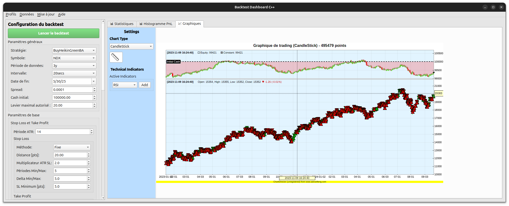

# IG Trading Bot

[](LICENSE)
[](https://python.org)
[](https://isocpp.org)
[](https://qt.io)
[](https://cmake.org)

## 🚀 Présentation

**IG Trading Bot** est une plateforme complète de trading algorithmique conçue pour l'écosystème IG Markets. Ce projet hybride combine la flexibilité du Python pour le trading en temps réel avec la puissance du C++ pour les backtests haute performance.

### ✨ Points forts du projet

- **🔄 Architecture hybride** : Python pour l'API trading, C++ pour le calcul intensif
- **📊 Interface graphique avancée** : Application Qt native avec visualisations ChartDirector
- **⚡ Performance optimisée** : Moteur de backtest C++ multi-threadé
- **🎯 Stratégies modulaires** : Framework extensible pour développer vos propres algorithmes
- **📈 Analyse complète** : Métriques avancées, graphiques interactifs et historiques détaillés
- **🛡️ Gestion des risques** : Contrôles intégrés et modes démo/live

### 🎯 Fonctionnalités principales

#### Trading automatisé
- ✅ Connexion native à l'API IG Markets
- ✅ Exécution en temps réel avec gestion des ordres
- ✅ Surveillance continue des positions
- ✅ Mode démo pour tests sécurisés

#### Backtesting haute performance
- ✅ Moteur C++ optimisé pour la vitesse
- ✅ Interface graphique Qt avec visualisations avancées
- ✅ Métriques complètes (Sharpe, Sortino, drawdown, etc.)
- ✅ Analyse des trades et courbes d'équité

#### Stratégies et indicateurs
- ✅ Stratégies de suivi de tendance prêtes à l'emploi
- ✅ Indicateurs techniques : RSI, EMA, Stochastique
- ✅ Framework extensible pour stratégies personnalisées
- ✅ Pont Python-C++ pour maximum de flexibilité

#### Monitoring et analyse
- ✅ Interface web pour surveillance en temps réel
- ✅ Logging détaillé et historiques
- ✅ Notebooks Jupyter pour analyse de données
- ✅ Export des résultats et rapports

### 🏗️ Architecture technique

Le projet adopte une architecture modulaire permettant d'exploiter les forces de chaque langage :

- **Frontend** : Interface Qt6 native pour une expérience utilisateur fluide
- **Backend Trading** : Python avec intégration API IG Markets
- **Moteur de calcul** : C++17 pour les backtests et calculs intensifs
- **Visualisation** : ChartDirector pour des graphiques professionnels
- **Build system** : CMake cross-platform avec scripts d'automatisation

Cette approche garantit à la fois la rapidité d'exécution pour les backtests et la flexibilité pour le développement de stratégies.

### 📸 Aperçu de l'interface



*Interface graphique Qt de l'application de backtesting avec visualisations ChartDirector*

---

## Installation

### 1. Cloner le dépôt

Clonez le dépôt et placez-vous à la racine du projet :

```bash
git clone https://github.com/hugoMiCode/ig-trading-bot
cd ig-trading-bot
```

### 2. Installer les dépendances

Installez les dépendances nécessaires à partir du fichier `requirements.txt` :

```bash
pip install -r requirements.txt
```

L’installation en mode développement vous permet de modifier le code source et de voir immédiatement les modifications sans avoir à réinstaller le package.

### 3. Configurer vos identifiants IG

Copiez le fichier `.env-example` en `.env` et renseignez-y vos identifiants et configurations :

```bash
cp .env-example .env
```

Ouvrez ensuite `.env` dans votre éditeur et ajoutez vos informations.

---

## Structure du projet

```
ig-trading-bot/
├── build_and_run.sh*
├── ChartDirector/
│   ├── CMakeLists.txt
│   ├── cppdemo/
│   ├── include/
│   ├── lib/
│   ├── LICENSE.TXT
│   ├── qtdemo/
│   └── README.TXT
├── CMakeLists.txt
├── cpp_adaptator/
│   ├── CMakeLists.txt
│   ├── include/
│   └── src/
├── cpp_backtestApp/
│   ├── backtest_config.ini
│   ├── CMakeLists.txt
│   ├── icons/
│   ├── include/
│   ├── qresources.qrc
│   └── src/
├── cpp_backtestEngine/
│   ├── CMakeLists.txt
│   ├── include/
│   └── src/
├── cpp_strategies/
│   ├── CMakeLists.txt
│   ├── include/
│   ├── pyproject.toml
│   ├── setup.py
│   └── src/
├── Doxyfile
├── igtrader/
│   └── WrapperIGAPI/
├── live_interface/
│   ├── api_server.py
│   ├── ig_candle_service.py
│   └── static/
├── logs/
│   └── backtest/
├── marketData/
├── Notebooks/
│   ├── Backtest.ipynb
│   ├── Helpers.py
│   ├── IBKR_API.ipynb
│   ├── PolygonAPI.ipynb
│   └── __pycache__/
├── pyproject.toml
├── README.md
├── requirements.txt
├── scripts/
│   ├── cmd_app.py
│   ├── live_Display_IG.py
│   └── liveIG.py
├── setup.py
└── VERSION
```

### Description des composants

#### Composants Python
- **`igtrader/`** : Interface avec l'API IG Markets
- **`live_interface/`** : Serveur API et services de données en temps réel
- **`scripts/`** : Points d'entrée pour différents modes d'exécution
- **`Notebooks/`** : Analyse et développement de stratégies

#### Composants C++
- **`cpp_backtestEngine/`** : Moteur de backtest haute performance
- **`cpp_backtestApp/`** : Interface graphique Qt pour les backtests
- **`cpp_strategies/`** : Stratégies de trading en C++
- **`cpp_adaptator/`** : Pont entre Python et C++

#### Dépendances externes
- **`ChartDirector/`** : Bibliothèque de graphiques (licence commerciale)

---

## Utilisation

### En mode live

Pour exécuter le bot en mode live :

```bash
python scripts/liveIG.py
```

# Guide de compilation et d'exécution du projet ig-trading-bot

Ce guide explique comment compiler, exécuter et déboguer le projet ig-trading-bot de manière progressive, en partant des méthodes manuelles jusqu'aux configurations plus avancées.

## Prérequis

- CMake 3.14 ou supérieur
- GCC/G++ avec support C++17
- Qt6.8.3 (Core, Widgets, Charts, Network)
- VS Code (pour le débogage)
- Extensions VS Code: C/C++, CMake Tools

## 🔧 Installation des prérequis (Linux)

### Étape 1: Installation des outils de compilation

Installez les outils de développement essentiels :

```bash
# Mise à jour des paquets
sudo apt update

# Installation des outils de compilation
sudo apt install -y build-essential git curl wget

# Installation des bibliothèques graphiques nécessaires pour Qt
sudo apt install -y libgl1-mesa-dev libglu1-mesa-dev
```

### Étape 2: Installation de CMake 4.0.3

Téléchargez et installez CMake manuellement pour avoir une version récente :

```bash
# Télécharger CMake 4.0.3
cd ~
wget https://github.com/Kitware/CMake/releases/download/v4.0.3/cmake-4.0.3-linux-x86_64.tar.gz

# Extraire l'archive
tar -xzf cmake-4.0.3-linux-x86_64.tar.gz

# Ajouter CMake au PATH (temporaire)
export PATH=$HOME/cmake-4.0.3-linux-x86_64/bin:$PATH

# Vérifier l'installation
cmake --version
```

### Étape 3: Installation de Qt 6.8.3

Téléchargez et installez Qt depuis le site officiel :

```bash
# Télécharger Qt Online Installer
cd ~
wget https://d13lb3tujbc8s0.cloudfront.net/onlineinstallers/qt-unified-linux-x64-4.6.1-online.run

# Rendre l'installeur exécutable
chmod +x qt-unified-linux-x64-4.6.1-online.run

# Lancer l'installeur
./qt-unified-linux-x64-4.6.1-online.run
```

**Instructions pour l'installeur Qt :**
1. Créez un compte Qt (gratuit pour usage personnel)
2. Sélectionnez **Qt 6.8.3** 
3. Cochez **Desktop gcc 64-bit**
4. Installez dans le répertoire par défaut : `~/Qt/`

### Étape 4: Installation de spdlog v1.15.3

Installez la dernière version de spdlog depuis les sources GitHub :

```bash
# Télécharger et extraire spdlog v1.15.3
cd /tmp
wget https://github.com/gabime/spdlog/archive/refs/tags/v1.15.3.tar.gz
tar -xzf v1.15.3.tar.gz
cd spdlog-1.15.3

# Compiler et installer spdlog
mkdir build && cd build
cmake .. -DSPDLOG_BUILD_PIC=ON -DBUILD_SHARED_LIBS=ON
make -j$(nproc)
sudo make install
sudo ldconfig

# Nettoyer les fichiers temporaires
cd /tmp && rm -rf spdlog-1.15.3 v1.15.3.tar.gz
```

### Étape 5: Configuration permanente du PATH

Ajoutez CMake et Qt à votre PATH de manière permanente :

```bash
# Ajouter au fichier .bashrc
echo '# Ajouter cmake et Qt au PATH' >> ~/.bashrc
echo 'export PATH=$HOME/cmake-4.0.3-linux-x86_64/bin:$PATH' >> ~/.bashrc
echo 'export PATH=$HOME/Qt/6.8.3/gcc_64/bin:$PATH' >> ~/.bashrc
echo 'export CMAKE_PREFIX_PATH=$HOME/Qt/6.8.3/gcc_64:$CMAKE_PREFIX_PATH' >> ~/.bashrc

# Recharger la configuration
source ~/.bashrc
```

### Étape 6: Vérification de l'installation

Vérifiez que tous les outils sont correctement installés :

```bash
# Vérifier CMake
cmake --version

# Vérifier Qt
qmake --version

# Vérifier spdlog
pkg-config --modversion spdlog

# Vérifier les compilateurs
gcc --version
g++ --version
```

**Résultats attendus :**
- CMake version 4.0.3
- Qt version 6.8.3
- spdlog version 1.15.3
- GCC/G++ version 13.x ou supérieure

### Étape 7: Test de compilation

Testez la compilation du projet :

```bash
# Se placer dans le projet
cd ~/ig-trading-bot

# Créer le dossier de build
mkdir -p build && cd build

# Configurer avec CMake
cmake ..

# Compiler
make -j$(nproc)
```

Si tout fonctionne correctement, vous devriez voir :
```
-- Qt6 détecté automatiquement: /home/username/Qt/6.8.3/gcc_64
-- Configuration terminée avec succès
-- Build files have been written to: /path/to/build
[100%] Built target backtestapp
```

---

## Méthode 1: Compilation manuelle avec CMake

Cette méthode est la plus basique et fonctionne sur tout système compatible:

```bash
# Créer le dossier de build
mkdir -p build
cd build

# Configurer le projet - mode Release (par défaut)
cmake ..

# Compiler le projet
make -j$(nproc)  # Utilise tous les cœurs disponibles

# Exécuter l'application
./cpp_backtestApp/backtestapp
```

### Compilation en mode Debug

```bash
# Dans le dossier build
cmake -DBUILD_WITH_DEBUG=ON ..
make -j$(nproc)
```

## Méthode 2: Utilisation du script **build_and_run.sh**

Le script automatise le processus de compilation et d'exécution:

```bash
# Compilation standard et exécution
./build_and_run.sh

# Compilation en mode debug et exécution
./build_and_run.sh --debug

# Nettoyage du dossier build avant compilation
./build_and_run.sh --clean

# Compilation sans exécution
./build_and_run.sh --no-run
```

## Méthode 3: Configuration VS Code pour le débogage

Utiliser les fichiers `./vscode/launch.json` et `./vscode/tasks.json` 

Choisir son système d'exploitation et le mode (Debug/Release) dans l'onglet run/debug de VSCode

### Comment utiliser le débogueur

1. Placez des points d'arrêt en cliquant dans la marge à gauche des numéros de ligne
2. Appuyez sur F5 pour lancer le débogueur
3. Utilisez les contrôles de débogage:
   - F10: Pas à pas principal (step over)
   - F11: Pas à pas détaillé (step into)
   - Shift+F11: Sortir de la fonction (step out)
   - F5: Continuer l'exécution

## Points d'entrée du projet

Voici un résumé des différentes façons de compiler et exécuter le projet:
1. **Compilation et exécution manuelles**:
   
   **Linux / macOS :**
   ```bash
   cmake ..
   make -j$(nproc)
   ./cpp_backtestApp/backtestapp
   ```
   
   **Windows :**
   ```bash
   cmake ..
   cmake --build . --config Release --parallel
   .\cpp_backtestApp\backtestapp.exe
   ```

2. **Script automatisé** (Linux/macOS uniquement):
   ```bash
   ./build_and_run.sh
   ```

3. **Compilation avec VS Code**:
   - Ctrl+Shift+B: Lance la tâche de compilation par défaut (build-debug)
   - Terminal > Run Task > build-release: Pour une version optimisée

4. **Débogage avec VS Code**:
   - F5: Lance le débogueur avec les points d'arrêt définis

## Remarques importantes


### Contributeurs

- **[hugoMiCode](https://github.com/hugoMiCode)** - Co-créateur et mainteneur principal / spé&cialiste architecture du code
- **[maks7d](https://github.com/maks7d)** - Co-créateur / branleur
- **[alexandre5-0](https://github.com/alexandre5-0/alexandre5-0)** - Bêta testeur / expert trading et concepteur stratégie
#### Comment contribuer

1. Forkez le projet
2. Créez une branche pour votre fonctionnalité (`git checkout -b feature/AmazingFeature`)
3. Commitez vos changements (`git commit -m 'Add some AmazingFeature'`)
4. Poussez vers la branche (`git push origin feature/AmazingFeature`)
5. Ouvrez une Pull Request

Les contributions de tous types sont les bienvenues : corrections de bugs, nouvelles fonctionnalités, amélioration de la documentation, tests, etc.

