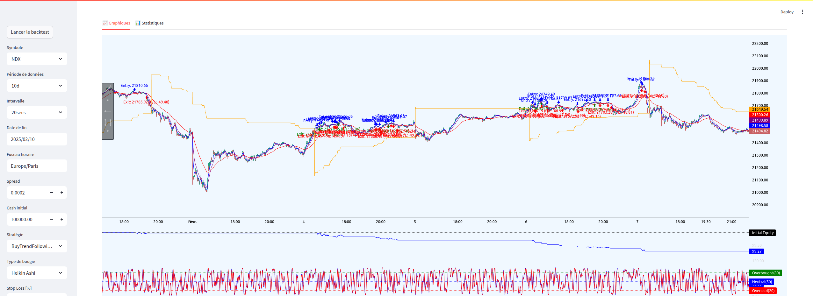

# backtest_interface

## Getting started

To get started with the backtest interface, follow the instructions below:



``` 
cd ~/ig-trading-bot && sudo docker compose up -d --build
```

Then you can view the backtest interface at this URL: 

```
http://localhost:9018
```

## Add your files

- [ ] [Create](https://docs.gitlab.com/ee/user/project/repository/web_editor.html#create-a-file) or [upload](https://docs.gitlab.com/ee/user/project/repository/web_editor.html#upload-a-file) files
- [ ] [Add files using the command line](https://docs.gitlab.com/topics/git/add_files/#add-files-to-a-git-repository) or push an existing Git repository with the following command:

```
cd backtest_interface
git remote add origin http://10.8.0.1:9000/Maxxime/backtest_interface.git
git branch -M main
git push -uf origin main
```
